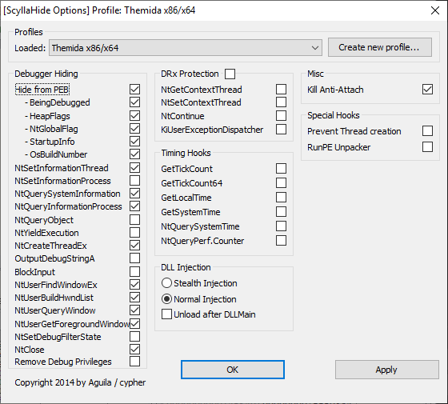

# Unattended ArcheAge client database extractor

This directory contains resources for extracing ArcheAge client database unattended.

Requirements:
* A supported ArcheAge version (global builds since 25.11.2021 including ArcheWorld)
* Node.js (LTS version will do)
* x64dbg with plugins:
  * ScyllaHide - used for getting past antidebugger
  * dotx64dbg - used for exiting x64dbg at the end

## ⚠️ Update: 22.08.2024 ⚠️

It appears that ArcheWorld (and presumably also ArcheAge) is now loading the first part of XIGNCODE3 module earlier in the game's startup process, which restricts accessing game's memory once the database has been extracted. You can use the xigncode-bypass provided in this repository to circumvent this. Rest of the instructions remain the same.

## Demo

[Video on YouTube](https://www.youtube.com/watch?v=QluhuvCu5p8)

## Setup

### This repository

First clone the repository.

Rename all aboslute paths to current directory path. I've left my name - `Indrek` everywhere where it is necessary to modify path.

Point the game paths `C:\KakaoGames\ArcheAge` to your actual game directory containing game_pak.

### Node.js

Running `npm install` should be sufficient. If you get installation errors, you may need to install a newer version of [`better-sqlite3`](https://www.npmjs.com/package/better-sqlite3) package.

### x64dbg

Script expects x64dbg directory to be placed in x64dbg directory in this repository.

Location of x64dbg.exe should be at `x64dbg\release\x64\x64dbg.exe`

Once you have plugins stated above installed, open up ArcheAge.exe once and leave it paused in debugger.

Open `Plugins -> ScyllaHide -> Options` and set your profile to following. Hit OK or Apply after.



Open `Options -> Preferences` and only have `System Breakpoint*` and `Entry Breakpoint*` enabled, rest unchecked. Save.

Finally open `Options -> System breakpoint scripts` and set `2. System breakpoint script for archeage.exe` to `dump-archeage-database.txt` file in this repository.

## Usage

Originally this was only meant to be used with Kakao Games distributed builds. For that I simply ran `get-database-kakaodl.bat`, entered the desired patch number and rest was done automatically.

However since the Kakao CDN is destined to be shut down, `get-database.bat` will skip the download and patching process and will go straight to extracting the database from the game.

If all goes well, at the end of the process you should be seeing a `.sqlite` file in the chosen directory which can be opened with any database browser. Comparing different databases across game builds can be done with sqlite's `sqldiff` tool.

## Possible errors

### Schema errors

Since schema of the database can change any update without warning, you are responsible for maintaining the schema. Table information in schema is declared in the same order as the data appears in the database file. Generally changes between patches are incremental, which means you can generally just use a disassembler (use a `x2game.dll` extracted using Scylla that comes with x64dbg, then open it in Ghidra), search the last table name / sql statement string that `reader.js` was successful at reading and going back and forth between nearby functions, finding the new SQL query and column types, placing them in the schema file and rerun.

### x64dbg will not extract a correct database.zip

Either your setup is wrong or if it worked in past for you, then XL likely patched it. 안녕

## How it works

First red herring that every newcomer falls onto is the observation that the file in game_pak is named `compact.sqlite`. This immediately makes people try to open that file with a SQLite browser and find out that didn't work. Only real hint on the internet that's easily searchable is the fact that the file [used to be](https://web.archive.org/web/20240428081012/https://archeagecodex.com/forum/viewtopic.php?f=2&t=90) SQLite format, but isn't anymore.

If we open up the file, it has no recognizable format, so the most people will already conclude that the file must be encrypted, which is correct. Another previously searchable [reference](https://web.archive.org/web/20220310003844/https://zenhax.com/viewtopic.php?t=1336#p7258) confirms that the format is far from a SQLite3 database including few other facts:

* There is some kind of AES encryption used multiple times, plus some kind of XOR function.
* The key is embedded in the game files (dll) as constants.
* On top of that there are certain modifications which makes using general purpose tools to decrypt the database impossible.
* The database file is actually a ZIP file containing actual data files.

I am going to skip explaining every single detail, however if you care enough, you can open x2game.dll of any game build between 25.11.2021 and 30.08.2022 in a disassembler and get unobfuscated access to the functions that do the decryption.

The AES implementation is mostly standard (difference being that each block is XOR-ed with IV), however to get the key, you need to find four seed constants supplied to `XLRandom::XLRandom` function, some of them are responsible for generating the AES keys, others shift around blocks once AES has been decrypted at various locations. Part of the data from the file is pasted as an array into the dll, including the ZIP header itself. Regardless of how it's encrypted, the end result is that at some point the decrypted/deobfuscated data will reside in memory as a ZIP archive.

The script `dump-archeage-database.dll` aligns itself based on a byte pattern that appears in every x2game.dll tried so far (which stays the same as long as the surrounding code stays unchanged). Then it reads the memory location where the database ZIP file will be placed in memory along with the projected length. Next it lets the game do decryption and stops again when there is a complete ZIP file in memory, dumps the memory at previously found location with specified length and close the disassembler. This approach effectively ignores the method of encryption used and is only interested in the resulting bytes.

### Contents of the ZIP file

The zip file contains files game0 - game11. 0-10 containing localization information per language (korean is game0, english is game2). game11 includes data that's common regardless of the language.

Coming back to the "it used to be SQLite" part, these files now contain pre-baked result sets for certain SQL the game will use in sequence. XL has simply streamlined all of them into a binary format with basic delimiters to make the game load faster without the overhead of SQLite.

The delimiters for rows are bytes `0x64 (100)` and  `0x65 (101)` for start and end respectively. The first query in `game11` corresponds to the result produced by query `pragma integrity_check`, for which we should expect a single text result with the string `ok` and a null delimiter:
`64 00 6F 6B 00 65` -> `<0x64 start><0x0 means that following string is literal><string content until 0x0 is encountered><0x65 end>`.

Because the information provided in data file does not contain any database table/column information, the table boundaries, column types and names of the columns have to be obtained from game dll-s and kept as a separate schema. To find new information, simply locating string constants containing SQLite queries will make it rather easy to find the correct locations for corresponding functions responsible for extracting the data. Once you get used to looking at these, you will find quickly that most columns are extracted functions such as `(a1 + 104)(a1, &v1, column index)`, where 104 is offset for a function that will return an integer. Some known offsets:
```
104 - integer
120 - string
56  - boolean
96  - real
```

Pairing this type/column index information with the SQL queries which are provided as strings should be enough to parse the entire length of the data files and reverse a functioning SQLite database.

Parser and so far extracted schemas are included with project to serve as a historical reference. Expect the very last one to only work shortly after release (few months at best). After that you are on your own to update the schema or parser whenever something breaks.

## Prior art

Though I discovered the format independently at a later date, triviality of the data format implemented as parser in reader.js led me to find this project afterwards. Mostly confirming my own findings and seems to be architected better than what I had made for myself.

https://github.com/NL0bP/ArcheAge-DB-Parser
